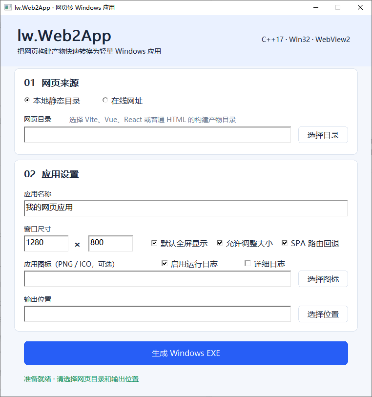
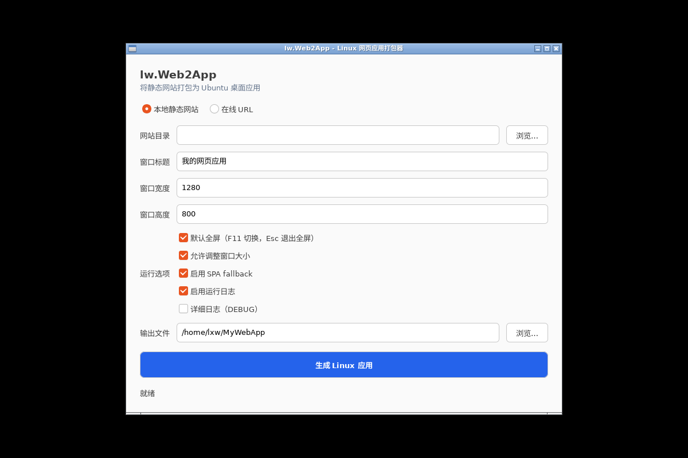

# lw.Web2App

[简体中文](README.md) | [English](README_EN.md)

一个面向桌面平台的轻量网页应用打包工具。当前版本支持 Windows x64，并提供 Ubuntu 22.04/24.04 x86_64 Beta，可在无需重新编译网页项目的情况下，将 HTML、Vue、React、Vite 等静态产物打包为单文件桌面应用。

目标电脑不需要安装 Node.js、Rust、.NET 或 Electron。Windows 使用 Microsoft WebView2 Evergreen Runtime；Linux 使用系统提供的 GTK3 与 WebKitGTK 4.1。

> **平台状态：** Windows 10/11 x64 为稳定版；Ubuntu 22.04/24.04 x86_64 为首个 Linux Beta。Linux 已实现 GTK3 图形打包器、CLI、ELF Runner、WebKitGTK Runtime、单文件 Payload、日志及 `.deb`/`.tar.gz` CI 产物。当前不支持其他发行版、ARM64、AppImage 或 RPM。

Windows 图形打包器：



Linux 图形打包器（Ubuntu 22.04）：



## 功能特性

- Windows 使用原生 Win32 + WebView2，Linux 使用 GTK3 + WebKitGTK 4.1，两端均提供 GUI 和 CLI。
- 图形界面实时显示打包阶段和结果状态，状态区域采用独立重绘，连续更新时保持清晰。
- Windows 图形界面支持 Per-Monitor V2 高 DPI，控件、字体、边距和绘制区域会随显示器缩放重新布局。
- 本地 HTML、Vue、React、Vite 静态目录打包为单个 Windows EXE 或 Linux ELF 应用。
- 在线 `http://`、`https://` 地址打包为单文件桌面应用。
- Windows 使用 WebView2 Evergreen Runtime；Linux 动态使用系统 WebKitGTK，生成应用不会捆绑完整浏览器内核。
- 自主设计的 `LWWEB002` V2 Payload 容器格式，并兼容读取 `LWWEB001` V1。
- 程序启动时验证资源 ZIP 与 Manifest 的联合 SHA-256，内容或配置损坏时拒绝继续运行。
- 生成应用默认无边框全屏显示，支持 `F11` 切换全屏、`Esc` 退出全屏。
- 基于 spdlog 的打包器/Runtime 滚动日志，默认 INFO、单文件 2 MiB、保留 5 个。
- 只索引 ZIP 中央目录，请求资源时才解压对应文件，不会启动即展开全部内容。
- 32 MiB LRU 缓存小型热点资源，大文件不长期驻留内存。
- 支持 Vue Router、React Router 等 history 模式所需的 SPA fallback。
- GUI 自动扫描并稳定排序 `.html`/`.htm` 启动页；Manifest、GUI 与 CLI 分别用 `entry` 和 `start_path` 支持传统多页面入口及 SPA 初始路由。
- 本地 HTTP 服务仅监听 `127.0.0.1`，每个 `app_id` 优先使用稳定的应用专属动态端口；端口被无关程序占用时会自动尝试确定性的备用端口。
- Windows 使用 Named Mutex、Linux 使用 `flock` 实现真正的跨平台单实例，单实例状态不再依赖 HTTP 端口占用。
- 可选的受控后台代理把 `/__lw_proxy__/...` 同源请求转发到 Manifest 固定的传统 HTTP Origin，不需要关闭 WebView 安全策略，Windows 与 Linux 共用同一实现。
- 校验精确 Host，不默认开放跨域，不提供目录浏览。
- 拒绝绝对路径、盘符、`..`、NUL、重复 ZIP 路径。
- 限制资源数量、单文件大小和总解压大小，降低 ZIP 炸弹风险。
- 支持 PNG、ICO 应用图标和完整 Windows PE 版本信息。
- 支持中文目录、中文文件名和中文应用标题。

## 工作原理

lw.Web2App 采用“平台 Runner + 文件尾部载荷”的方式生成单文件应用。它不是把网页源码翻译成 C++，也不会把 Chromium、Node.js 或 Electron 塞进每个程序。Windows 复用 WebView2，Linux 复用 WebKitGTK；两端共享 Manifest、ZIP、SHA-256、本地 HTTP 服务、路径安全和 LRU 缓存核心。

### 打包阶段

1. **检查输入**：本地模式先扫描并确认 `entry` 指定的入口 HTML 存在，校验 `start_path` 只能定位当前本地服务，并对文件数量、单文件大小及总大小应用安全上限。
2. **复制 Runner**：以当前平台的 `lw.Web2App.exe` 或 `lw.Web2App` 为模板，只复制其原始 PE/ELF Runner 部分。即使使用已经打包过的应用再次打包，也不会嵌套旧载荷。
3. **写入平台元数据**：Windows 更新图标、产品名、文件说明、公司、版本和版权等 PE 资源；Linux 为生成文件补充可执行权限。Linux 桌面图标与菜单项由 lw.Web2App 自身的 DEB 包安装，任意生成应用的独立桌面集成留待后续版本。
4. **构建 ZIP**：递归读取静态目录，将规范化后的相对路径流式压缩到临时 ZIP 文件，避免把源文件和完整 ZIP 同时驻留内存。绝对路径、盘符、`..`、NUL 和重复路径会被拒绝。
5. **追加容器**：依次在 PE/ELF 文件尾部流式写入资源 ZIP、Manifest JSON 和固定 80 字节 Footer。V2 Footer 记录格式版本、标志、各区段偏移/长度，以及“资源 ZIP + Manifest”的联合 SHA-256。

在线 URL 模式不保存远端网站内容，ZIP 为空；Manifest 只记录目标 URL 和窗口配置，启动时直接导航到该地址。因此在线模式需要联网，页面变化也会随网站实时变化。Linux Runtime 会将 `http_proxy`、`https_proxy`、`all_proxy` 和 `no_proxy`（同时兼容大写形式）传递给 WebKitGTK。

### 运行阶段

1. 程序从自身末尾读取 `LWWEB002` Footer；没有 Footer 时显示当前平台的打包器界面，有 Footer 时进入生成应用模式，同时仍可读取旧版 `LWWEB001`。
2. Runner 检查所有偏移和长度是否位于当前 PE/ELF 文件内，限制 Manifest 大小，并计算资源 ZIP 与 Manifest 的联合 SHA-256。校验失败时拒绝打开嵌入内容。
3. 本地模式只读取 ZIP 中央目录建立索引，不会把网站完整解压到磁盘或一次性载入内存。
4. Runner 先通过 Windows Named Mutex 或 Linux `flock` 获取 `app_id` 专属单实例锁，再在 `127.0.0.1` 的稳定首选端口启动 HTTP 服务。服务严格检查 Host，按请求解压单个资源、设置 MIME 类型，并在需要时提供 SPA fallback；首选端口被无关进程占用时会尝试确定性的备用端口并写入日志。
5. 如果 Manifest 启用了 `backend_proxy`，本地服务会在静态资源之前匹配 `/__lw_proxy__/`。它只向固定 `origin` 转发 GET、HEAD、POST、PUT、PATCH、DELETE 和 OPTIONS，保留查询参数及请求体，并改写 Cookie 与同源重定向；网页不会直接连接局域网后台。
6. 小型热点资源进入 32 MiB LRU 缓存；大文件按请求读取，不长期占用内存。
7. Windows 原生窗口创建 WebView2 Controller；Linux GTK3 窗口创建 WebKitGTK WebView。本地模式把私有服务地址与 Manifest 的 `start_path` 组合后导航；请求文件不存在且启用了 SPA fallback 时返回 `entry`。因此传统多页面应用可使用 `entry=login.html`、`start_path=/login.html`，Vue/React history 路由可使用 `entry=index.html`、`start_path=/login`。旧包没有 `start_path` 时默认使用 `/`。窗口策略同样来自 Manifest；可用 `F11` 切换全屏、`Esc` 退出。
8. 每个应用使用稳定 `app_id`。Windows 浏览器数据位于 `%LOCALAPPDATA%\lw.Web2App\apps\<app_id>\WebView2`；Linux 数据位于 `$XDG_DATA_HOME/lw.Web2App/apps/<app_id>/webkitgtk`，缓存位于 `$XDG_CACHE_HOME/lw.Web2App/apps/<app_id>/webkitgtk`。重命名应用不会改变存储位置。

`WebView2` 目录是 Microsoft WebView2 所需的可写用户数据目录，保存 Cookie、登录状态、localStorage、IndexedDB、HTTP 缓存、Service Worker 和站点权限。它不能在保持完整浏览器功能的同时彻底取消；显式放在 `%LOCALAPPDATA%` 可以避免 EXE 位于 `Program Files` 等只读目录时启动失败。应用完全退出后可以删除该目录来重置网页数据，但下一次启动仍会自动创建。

### 兼容旧式 HTTP 后台

勾选“HTTP 后台代理”并填写固定后台地址后，Runtime 会启用受控反向代理，用于兼容旧式 HTTP 局域网后台。例如后台地址为 `http://192.0.2.10:8080` 时，前端需要把原来的绝对基地址改为（`192.0.2.0/24` 是专供文档使用的保留网段）：

```javascript
const apiBase = "/__lw_proxy__";
```

于是 `/__lw_proxy__/sysUser/login` 由 C++ Runtime 转发为 `http://192.0.2.10:8080/sysUser/login`。页面看到的请求仍与 `127.0.0.1` 页面同源，因此不依赖 CORS、PNA 或 `--disable-web-security`。代理固定目标 Host、拒绝跨站来源与跨 Host 重定向，过滤 hop-by-hop/代理认证 Header，限制请求体为 16 MiB、响应体为 64 MiB，并把后端 Cookie 限定到代理前缀。为避免旧系统把 Token 放在 URL 路径或查询参数中造成泄露，代理日志不记录目标路径，只记录方法、状态和耗时，也不记录密码、Cookie、Authorization 或请求体。

当前版本只支持 `http://` 后台，适用于可信局域网老系统；`https://` 代理、WebSocket、NTLM/Kerberos 和多个后台 Origin 暂未支持。硬编码绝对后台地址的旧项目仍需将基地址改为 `/__lw_proxy__`，工具不会自动重写压缩后的 JavaScript。

SHA-256 用于发现资源损坏或修改，不等同于发布者认证；Manifest 配置和整个 EXE 的可信发布仍应依靠 Authenticode 等代码签名机制。

## 日志与排障

lw.Web2App 使用 spdlog 同步滚动文件日志，默认级别为 INFO，单文件最大 2 MiB，保留当前文件及 5 个轮转文件。日志不写在 EXE 旁边，因此应用安装到 `Program Files` 或只读目录时也不依赖该目录的写权限。

- 打包器日志：`%LOCALAPPDATA%\lw.Web2App\logs\packer.log`
- 生成应用日志：`%LOCALAPPDATA%\lw.Web2App\apps\<app_id>\logs\app.log`
- Manifest/Payload 尚未成功加载时的启动错误：`%LOCALAPPDATA%\lw.Web2App\logs\launcher.log`

Linux 遵循 XDG Base Directory 约定：

- 打包器日志：`${XDG_STATE_HOME:-$HOME/.local/state}/lw.Web2App/logs/packer.log`
- 生成应用日志：`${XDG_STATE_HOME:-$HOME/.local/state}/lw.Web2App/apps/<app_id>/logs/app.log`
- 启动错误：`${XDG_STATE_HOME:-$HOME/.local/state}/lw.Web2App/logs/launcher.log`

INFO 记录打包阶段、资源数量与大小、Payload 摘要、服务端口、WebView2 版本、初始化和导航结果；DEBUG 额外记录静态资源请求、ZIP 缓存命中/未命中和 SPA fallback。Runtime 还会把 `console.error`、未捕获脚本错误和未处理 Promise rejection 记录为 `[WEB-ERROR]`，普通 `console.log` 不会写入日志。

图形界面默认勾选“启用运行日志”。勾选“详细日志”后对应 DEBUG；取消“启用运行日志”只关闭生成应用的 Runtime 日志，打包器仍会保留自己的打包诊断日志。日志初始化失败不会阻止应用继续启动或打包。

典型 Runtime 日志如下：

```text
2026-08-13 18:37:27.820 [info] [lw.WebRuntime] Payload format: LWWEB002
2026-08-13 18:37:27.820 [info] [lw.WebRuntime] Payload verification OK
2026-08-13 18:37:27.821 [info] [lw.WebRuntime] Resource server: 127.0.0.1:60435
2026-08-13 18:37:27.876 [info] [lw.WebRuntime] WebView2 Runtime: 135.0.3179.98
2026-08-13 18:37:28.503 [info] [lw.WebRuntime] WebView2 initialized
2026-08-13 18:37:28.623 [info] [lw.WebRuntime] Navigation completed
```

遇到白屏或启动失败时，建议先查看 `app.log`；如果没有生成应用目录，再查看公共 `launcher.log`。比较问题电脑和正常电脑的 Windows 版本、WebView2 版本、Payload 版本及首条 ERROR，通常可以快速定位运行环境、完整性校验或前端脚本问题。

日志设置保存在 Manifest 中，当前默认值如下；GUI 第一版只暴露启用状态和 INFO/DEBUG 级别，其余轮转参数使用安全默认值：

```json
{
  "logging": {
    "enabled": true,
    "level": "info",
    "max_file_size": 2097152,
    "max_files": 5
  }
}
```

## 系统要求

- Windows 10 1809+ / Windows 11 x64，以及 Microsoft WebView2 Evergreen Runtime；或
- Ubuntu 22.04 / 24.04 x86_64，以及 GTK3、WebKitGTK 4.1、OpenSSL 3 运行库。

Windows 11 和大多数仍在维护的 Windows 10 设备已经安装 WebView2 Runtime。未安装时，生成的程序会提示用户安装。

不支持 Windows 7/8。Linux 首版只承诺 Ubuntu 22.04/24.04 x86_64，不承诺 Debian、Linux Mint、国产发行版、ARM64、Wayland-only 环境或其他 WebKitGTK ABI；项目也不会捆绑完整浏览器 Runtime。

## 下载 CI 构建产物

每次推送和 Pull Request 都会通过 GitHub Actions 构建并测试 Windows x64、Ubuntu 22.04 x86_64 和 Ubuntu 24.04 x86_64：

1. 打开项目的 **Actions** 页面。
2. 选择最新一次成功的 `Windows and Linux x64` 工作流。
3. 在页面底部下载 `lw.Web2App-windows-x64` 或对应 Ubuntu 版本的 Artifact。

Artifact 中包含：

- `lw.Web2App.exe`
- `README.md` 和 `README_EN.md`
- `LICENSE`
- `THIRD_PARTY_NOTICES.md`
- `third_party/licenses/` 第三方许可证原文
- `examples/wechat-article-formatter.exe` CI 集成测试生成的示例应用
- `examples/wechat-article-formatter-LICENSE.txt` 示例项目许可证
- `lw.Web2App-vs2022-source.zip` 可直接复制、离线编译的完整 VS2022 解决方案
- `SHA256SUMS.txt`

推送 `v*` 标签时，CI 还会创建 GitHub Release，并附加可直接下载的 ZIP 包和 SHA-256 校验文件。

Linux Artifact 额外包含 lw.Web2App 的 `.deb`、便携 `.tar.gz`、生成的单文件 `examples/wechat-article-formatter` 以及各文件 SHA-256。`.deb` 安装 GTK/WebKitGTK 依赖并注册应用菜单；便携包与生成应用仍要求目标 Ubuntu 已安装运行库。

### CI 集成测试项目

[wechat-article-formatter](https://github.com/lxw112190/wechat-article-formatter) 是一个面向微信公众号的纯前端 Markdown 排版与编辑工具，采用 Vite、React 和 TypeScript，支持主题排版、手机预览及复制富文本正文。CI 会检出该项目的 `main` 分支，执行 `npm ci` 和 `npm run build` 生成 `dist`，再用本次构建的 lw.Web2App 将它打包成 `examples/wechat-article-formatter.exe`。随后运行 `inspect` 重新读取 Manifest 并验证 Payload SHA-256；任一步失败都会使工作流失败。

这个示例同时验证了真实 Vite/React 产物、中文标题、较多静态资源、SPA fallback、Windows PE 元数据、Linux ELF 权限和最终分发流程。Linux CI 还会在 Xvfb 中启动生成应用，并检查 WebKitGTK 初始化与导航完成日志。应用数据保存在各平台对应的本地浏览器存储中，请像使用网页版本一样定期导出备份。

## 从源码构建

构建环境：

- Visual Studio 2022，安装“使用 C++ 的桌面开发”工作负载
- CMake 3.22+
- 首次配置时可以访问依赖下载地址

```powershell
cmake -S . -B build -G "Visual Studio 17 2022" -A x64
cmake --build build --config Release --parallel
ctest --test-dir build -C Release --output-on-failure
```

构建产物位于：

```text
build/Release/lw.Web2App.exe
```

直接双击运行会打开图形界面。

### 可复制的 VS2022 离线解决方案

已经完成一次 CMake 配置并取得依赖后，可生成一个不含当前电脑绝对路径的完整 VS2022 源码包：

```powershell
powershell.exe -NoProfile -ExecutionPolicy Bypass `
  -File .\tools\create-vs2022-package.ps1 -Force
```

产物为 `dist/lw.Web2App-vs2022-source/` 和同名 ZIP。包内包含 `lw.Web2App.sln`、应用工程、核心静态库工程、测试工程、固定版本的全部 C++ 依赖及一键编译脚本。接收方只需安装 VS2022 的“使用 C++ 的桌面开发”工作负载，解压后直接打开解决方案即可编译，不需要 CMake、Ninja、vcpkg 或联网下载依赖。

Ubuntu 22.04/24.04：

```bash
sudo apt-get update
sudo apt-get install -y cmake ninja-build g++ pkg-config libgtk-3-dev \
  libwebkit2gtk-4.1-dev libssl-dev
cmake -S . -B build -G Ninja -DCMAKE_BUILD_TYPE=Release -DBUILD_TESTING=ON
cmake --build build --parallel
ctest --test-dir build --output-on-failure
cpack --config build/CPackConfig.cmake -G DEB -B dist
```

Linux 可执行文件为 `build/lw.Web2App`，DEB 位于 `dist/`。无参数启动会打开 GTK3 图形打包器。

### 可选离线依赖缓存

CMake 会优先从仓库根目录的 `.deps` 读取以下文件；文件不存在时才访问固定版本 URL：

```text
.deps/json.tar.xz
.deps/cpp-httplib.tar.gz
.deps/miniz.tar.gz
.deps/spdlog.tar.gz
.deps/webview2.zip
```

也可以用 `-DLWWEB_DEPS_CACHE=目录` 指向其他缓存位置。

## CLI 使用方法

### 打包本地静态目录

GUI 和 CLI 只扫描所选目录第一层的 `.html`/`.htm`，稳定排序并优先选择 `index.html`，不会把子目录中的业务页面误选为启动页。`entry` 表示 ZIP 中真实存在的 HTML，`start_path` 表示 WebView 首次打开的 URL 路径：

```powershell
lw.Web2App.exe pack .\dist .\MyApp.exe --title "我的应用"
```

完整示例：

```powershell
lw.Web2App.exe pack .\dist .\MyApp.exe `
  --entry index.html `
  --start-path /login `
  --title "我的应用" `
  --app-id com.example.myapp `
  --width 1280 `
  --height 800 `
  --windowed `
  --debug-log `
  --backend-origin http://192.0.2.10:8080 `
  --icon .\app.png `
  --company "示例公司" `
  --version 1.2.0.0 `
  --copyright "Copyright © 2026"
```

### 打包在线网址

```powershell
lw.Web2App.exe pack-url https://example.com .\Example.exe --title "在线应用"
```

### 检查生成的 EXE

`inspect` 会验证 Payload SHA-256 并输出 Manifest：

```powershell
lw.Web2App.exe inspect .\MyApp.exe
```

Linux 使用相同命令结构，不带 `.exe`，输出文件会自动获得可执行权限：

```bash
./lw.Web2App pack ./dist ./MyApp --title "我的应用"
./lw.Web2App inspect ./MyApp
./MyApp
```

其他开关：

- `--entry`：指定归档内真实入口 HTML，例如 `login.html` 或 `pages/login.html`。
- `--start-path`：指定首次导航路径，例如 `/login.html`、`/login` 或 `/#/login`；未指定时根据 `entry` 自动建议，根目录 `index.html` 对应 `/`。
- `--backend-origin`：启用跨平台受控后台代理并固定唯一 HTTP Origin，例如 `http://192.0.2.10:8080`；前端请求基地址应改为 `/__lw_proxy__`。
- `--no-spa`：关闭 SPA fallback。
- `--windowed`：覆盖默认行为，使生成应用以普通窗口启动。
- `--no-log`：关闭生成应用的运行日志。
- `--debug-log`：将运行日志级别设为 DEBUG，记录资源请求、ZIP 缓存和 SPA fallback。
- `--devtools`：允许打开开发者工具和默认右键菜单。
- `--app-id`：显式指定跨重启稳定的应用 ID；Windows 和 Linux 使用同一参数解析规则。
- `--company`：写入公司名称。
- `--version`：写入文件和产品版本。
- `--copyright`：写入版权信息。

已经生成的 EXE 也可继续执行 CLI 打包命令。程序只会复制原始 Runner 前缀，不会嵌套旧 Payload。

## Payload V2 格式

```text
Runner PE / ELF
Resource ZIP       在线 URL 模式为空
Manifest JSON
Footer             固定 80 字节
  magic[8]         LWWEB002
  version u32      2
  flags u32
  payloadOffset u64
  payloadSize u64
  manifestOffset u64
  manifestSize u64
  SHA-256[32]
```

全部整数都以显式小端方式序列化，不依赖 C++ 编译器的结构体对齐规则。V2 的 SHA-256 覆盖 Resource ZIP 与 Manifest JSON 的连续字节，因此 URL、窗口配置等 Manifest 内容被修改时也会被发现。Runner 仍兼容读取旧版 [Payload V1 格式](docs/format-v1.md)，新生成应用统一写入 V2。

## 安全边界

本项目用于打包可信的静态网页应用，不应被视为运行恶意网页内容的安全沙箱。

- 默认最多允许 100,000 个资源文件。
- 默认单文件最大 512 MiB。
- 默认总解压大小最大 2 GiB。
- Manifest 最大 1 MiB。
- HTTP 服务仅绑定 IPv4 loopback，且必须提供精确的应用专属端口 Host。
- 后台代理只接受 Manifest 固定的 `http://` Origin；拒绝任意 URL、跨站来源、跨 Host 重定向和与代理前缀冲突的 ZIP 资源，并限制请求/响应大小与超时。
- SHA-256 可以检测损坏或修改，但不能验证发布者身份；数字签名属于后续规划。

## 项目结构

```text
src/cli/       Windows/Linux 共用 UTF-8 CLI 解析与 PackOptions 构建
src/app/       Windows Win32 GUI、Runtime 和程序入口
src/linux/     Linux GTK3 GUI、WebKitGTK Runtime 和程序入口
src/webview/   WebView2 宿主
src/packer/    Manifest、Payload 和打包器
src/runtime/   ZIP 资源读取、LRU、本地 HTTP 服务和受控后台代理
src/pe/        图标和版本资源更新
src/common/    文件、路径和 SHA-256 工具
tests/         单元测试与打包/读取集成测试
```

## CI 与发布

CI 配置位于 [.github/workflows/build.yml](.github/workflows/build.yml)，执行以下流程：

1. Windows 2022 使用 VS2022 构建和测试 Windows x64。
2. Ubuntu 22.04、24.04 使用 Ninja、GTK3、WebKitGTK 4.1 和 OpenSSL 构建并测试 Linux x64。
3. 三个平台任务都构建 `wechat-article-formatter` 的 Vite 生产产物。
4. 分别生成 Windows EXE 或 Linux ELF，并用 `inspect` 验证 Payload SHA-256。
5. Linux 在 Xvfb 中运行生成应用，检查 WebKitGTK 初始化和导航日志。
6. 输出 Windows ZIP、Linux `.tar.gz`/`.deb` 与 `SHA256SUMS`，上传 Artifact。
7. 对 `v*` 标签汇总所有平台产物到 GitHub Release。

## 第三方依赖

- Microsoft WebView2 SDK：Microsoft 软件许可
- GTK3 / WebKitGTK / OpenSSL：Linux 系统动态依赖，遵循各自许可证
- miniz：MIT License
- cpp-httplib：MIT License
- nlohmann/json：MIT License
- spdlog（含 bundled fmt）：MIT License

具体信息见 [THIRD_PARTY_NOTICES.md](THIRD_PARTY_NOTICES.md)。

## Linux Beta 与后续规划

Ubuntu Linux 首版已经交付跨平台核心、GTK3 GUI、CLI、ELF Runner、WebKitGTK Runtime、XDG 数据/缓存/日志目录、DEB/TGZ 打包及双版本 CI。Payload 继续使用 `LWWEB002`，并兼容读取 `LWWEB001`。

当前 Linux Beta 的明确边界：

- 仅支持 Ubuntu 22.04/24.04 x86_64；生成应用必须在相同平台家族运行，不能把 Windows EXE 直接拿到 Linux，也不能跨平台生成另一端 Runner。
- 生成结果是带 Payload 的单文件 ELF；lw.Web2App 工具本身提供 `.deb`/`.tar.gz`，但尚未为每个任意生成应用制作独立 DEB、desktop 文件和图标。
- 使用系统 WebKitGTK 4.1，不捆绑浏览器内核，因此安全更新与 Web API 兼容性跟随 Ubuntu 更新。
- GTK 与 Win32 图形打包器都在后台线程压缩资源，界面在大型项目打包期间保持响应；取消操作和进度百分比属于后续改进。

下一阶段优先增加生成应用的 desktop/图标/DEB 元数据、AppImage 可行性、外部链接与下载策略；完成 x86_64 稳定性验证后再评估 ARM64、Debian 系和 RPM 系发行版。

其他后续方向：

- 多分辨率图标生成
- Authenticode 代码签名
- 托盘、第二次启动时前置已有窗口和窗口置顶
- 文件下载与外部链接策略
- JS 与 C++ 双向 IPC
- 自定义 User-Agent、启动参数和 CSP

## 联系与支持

- 作者：天天代码码天天
- QQ：819069052
- QQ Group：C# 人工智能实践 | 群号：758616458

如果项目对你有帮助，可以扫码支持维护：


## 许可证

本项目采用 [MIT License](LICENSE)。
